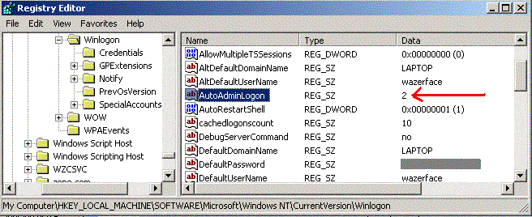



## A L@@K\! : Disabling CTRL \+ ALT \+ DELETE on Windows XP, NT and 2000\! \(using the registry\)

### Description

***Disabling CTRL-ALT-DELETE on Windows NT, Windows 2000, and Windows XP***

There is an undocumented way to disable the Ctrl Alt Del key sequence on Windows NT/2000/XP

using the registry.

The key, 'HKEY_LOCAL_MACHINE\SOFTWARE\Microsoft\Windows NT\CurrentVersion\Winlogon :

AutoAdminLogon (REG_SZ)' has only two legal values, according to Microsoft: "0" and "1". 0

disables automatic logon of the account stored, and 1 enables it. The strange thing is that

if you set the key to "2"...
 
### More Info
 

             |
---                |---
**Submitted On**   |
**By**             |[Wåzerface](https://github.com/Planet-Source-Code/PSCIndex/blob/master/ByAuthor/w-zerface.md)
**Level**          |Beginner
**User Rating**    |4.2 (59 globes from 14 users)
**Compatibility**  |VB 3\.0, VB 4\.0 \(16\-bit\), VB 4\.0 \(32\-bit\), VB 5\.0, VB 6\.0, VB Script, ASP \(Active Server Pages\) , VBA MS Access, VBA MS Excel
**Category**       |[Registry](https://github.com/Planet-Source-Code/PSCIndex/blob/master/ByCategory/registry__1-36.md)
**World**          |[Visual Basic](https://github.com/Planet-Source-Code/PSCIndex/blob/master/ByWorld/visual-basic.md)
**Archive File**   |

### Source Code

<B>
***Disabling CTRL-ALT-DELETE on Windows NT, Windows 2000, and Windows XP***

</B>

There is an undocumented way to disable the Ctrl Alt Del key sequence on Windows NT/2000/XP using the registry. 

The key, 'HKEY_LOCAL_MACHINE\SOFTWARE\Microsoft\Windows NT\CurrentVersion\Winlogon : AutoAdminLogon (REG_SZ)' has only two legal values, according to Microsoft: "0" and "1". 0 disables automatic logon of the account stored, and 1 enables it. The strange thing is that if you set the key to "2", it will enable automatic logon AND disable CTRL + ALT + DEL sequence registration by windows on boot, effectively disabling Task Manager, etc... Of course for this to work you will have to set the "DefaultUserName" and "DefaultPassword" keys to the username to automatically logon. 

I've found this the easiest way to kill the Ctrl-Alt-Del sequence.

&nbsp;

<B>
Again, here are the keys needed to be set:

</B>
<UL>
<B><LI>HKEY_LOCAL_MACHINE\SOFTWARE\Microsoft\Windows NT\CurrentVersion\Winlogon : AutoAdminLogon = "2"</LI></UL>
<UL>
<LI>HKEY_LOCAL_MACHINE\SOFTWARE\Microsoft\Windows NT\CurrentVersion\Winlogon : DefaultUserName = "(the username to automatically logon)"</LI></UL>
<UL>
<LI>HKEY_LOCAL_MACHINE\SOFTWARE\Microsoft\Windows NT\CurrentVersion\Winlogon : DefaultPassword = "(password for default username)"</LI></UL>
</B>

